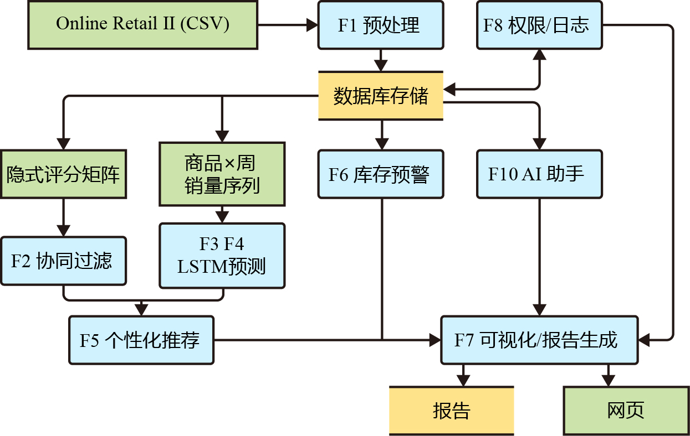
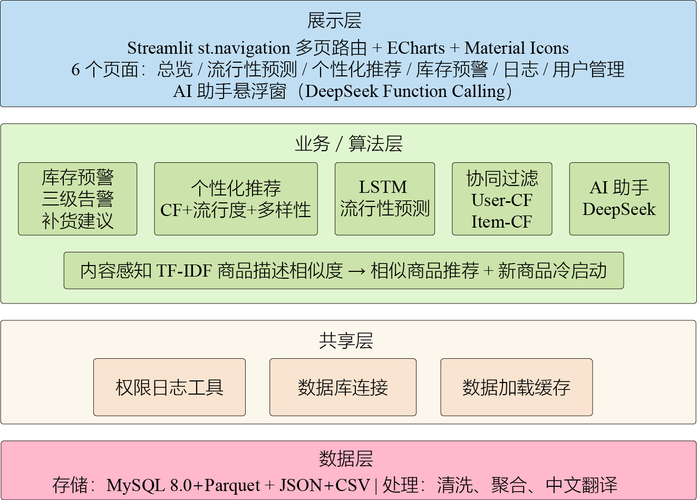
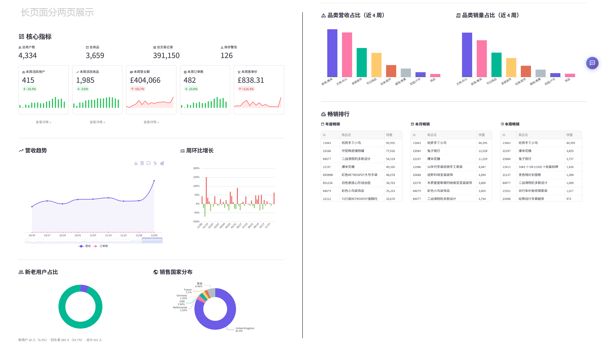
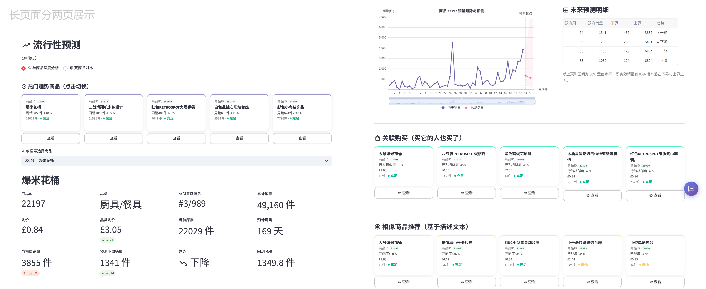
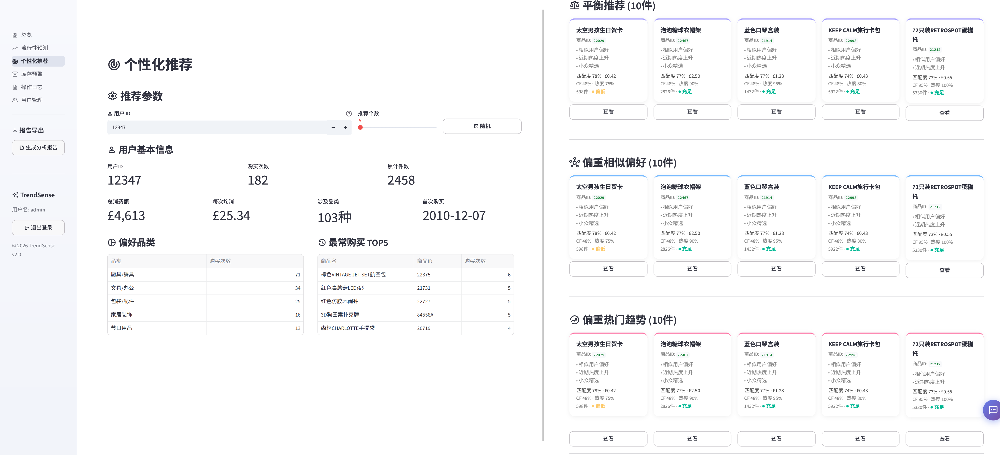
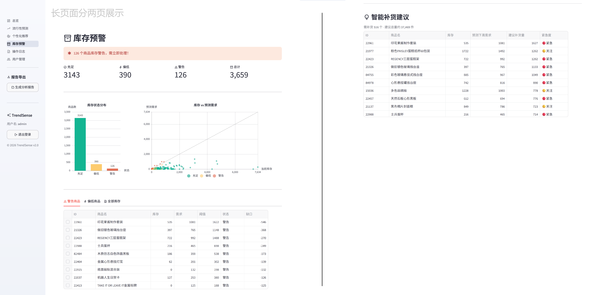
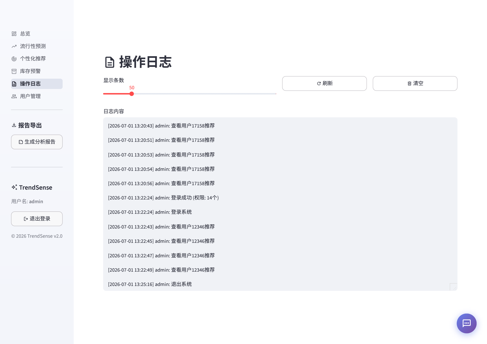
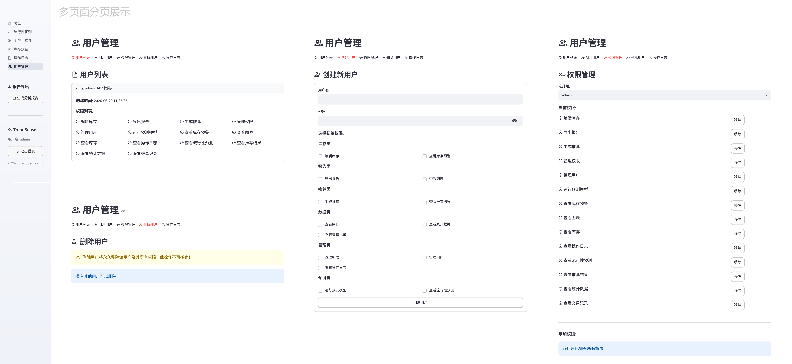

# TrendSense — 商品流行性预测与个性化推荐系统

基于 UCI Online Retail II 真实电商数据集（~39 万条交易记录，4,000+ 商品，4,300+ 用户，跨 53 周）构建的智能零售分析平台。融合 **LSTM 深度学习时序预测**、**协同过滤** 与 **TF-IDF 内容感知推荐** 三类算法，并提供完整的 Web 可视化仪表板。

---

## 系统架构

### 数据流



原始 CSV 经预处理 pipeline 产出 5 个标准化中间文件（Parquet / JSON），下游模块通过文件契约对接 —— LSTM 预测、协同过滤、内容感知推荐三者并行运行，结果汇入推荐融合引擎，最终由 6 个 Streamlit 页面呈现。AI 客服作为独立 Flask 服务通过 REST API 接入。

### 技术架构



---

## 技术栈

### 核心算法

| 技术                     | 用途                                                                                                                  |
| ------------------------ | --------------------------------------------------------------------------------------------------------------------- |
| **PyTorch**        | 构建双层 LSTM 网络，Huber 损失 + log1p 归一化，对 ≥30 周活跃商品逐商品微调，输出未来 4 周销量预测及 log 空间置信区间 |
| **scikit-learn**   | TF-IDF 商品描述向量化 + 余弦相似度计算，实现内容感知推荐；协同过滤离线评估（TimeSplit 交叉验证）                      |
| **Pandas / NumPy** | 全流程数据处理：清洗去重、缺失值填充、按周/用户/商品多维度聚合、特征工程                                              |

### 推荐系统

| 策略     | 方法                                                   | 离线指标                    |
| -------- | ------------------------------------------------------ | --------------------------- |
| 协同过滤 | Item-CF（隐式反馈，余弦相似度），预计算 Top-N 缓存     | HR@10 = 0.911, P@10 = 0.368 |
| 内容感知 | TF-IDF 商品描述向量 + 余弦相似度，冷启动回退           | 覆盖 3,659 种商品           |
| 融合推荐 | 三因子线性加权（CF + 流行度 + 多样性），三种策略可切换 | 支持新用户热门回退          |

### 后端与数据

| 技术                             | 用途                                                                                             |
| -------------------------------- | ------------------------------------------------------------------------------------------------ |
| **MySQL 8.0 + SQLAlchemy** | 消费记录与库存持久化存储；SQL 聚合（COUNT / SUM / GROUP BY）替代全表拉取，查询从 6.4s 降至 0.11s |
| **PyMySQL + cryptography** | 纯 Python MySQL 驱动，caching_sha2_password 认证                                                 |
| **Parquet / JSON**         | ML 中间产物（预测缓存、相似度矩阵）高效存储，列式压缩                                            |

### 前端可视化

| 技术                                  | 用途                                                                                                   |
| ------------------------------------- | ------------------------------------------------------------------------------------------------------ |
| **Streamlit 1.58**              | 全站 Web 框架：`st.navigation` 侧边栏路由、`@st.cache_resource` 全局数据常驻内存、跨页面零开销共享 |
| **ECharts** (streamlit-echarts) | 交互式图表：KPI sparkline、趋势折线图（dataZoom 缩放 + toolbox 导出）、品类排名柱状图、仪表盘          |
| **Material Icons**              | Streamlit 原生`:material/...:` 语法，统一图标体系                                                    |
| **自定义 CSS / HTML / JS**      | AI 悬浮聊天窗（`position:fixed` DOM 注入 + `parent.document` 跨 iframe 操控）                      |

### AI 智能客服

| 技术                                      | 用途                                                                                         |
| ----------------------------------------- | -------------------------------------------------------------------------------------------- |
| **DeepSeek API** (Function Calling) | 6 种业务工具函数（系统概览/热门商品/个性化推荐/库存状态/商品详情/系统信息），最大 5 轮对话   |
| **Flask + flask-cors**              | 独立 API 服务（端口 5000），CORS 允许 Streamlit 跨端口调用                                   |
| **自定义悬浮窗组件**                | 原生 HTML/CSS/JS 注入 Streamlit DOM，`position:fixed` 右下角悬浮，Enter 发送 / Escape 关闭 |

---

## 页面展示

### 系统总览



顶部四张 KPI 卡片展示核心指标（交易总数 / 活跃用户 / 商品数量 / 总销售额），带有环比变化指示。下方左侧为周销售额趋势折线图（支持区域缩放和工具箱导出），右上方为品类气泡图，右下方为本周畅销商品排行榜（含上周排名变化）。页面底部展示 LSTM 模型评估指标。

### 流行性预测



左侧面板选择商品和预测配置，显示当前商品的基本信息、品类、近期周销量统计。右上展示单商品未来 4 周销量预测折线图（含置信区间带），以及历史表现的全周期视图。支持双商品对比模式，将两个商品的预测趋势并排比较。并且针对不同商品进行了关联购买推荐和基于文本相似度的商品推荐。

### 个性化推荐



上方为用户选择区、用户用户基本信息以及购买历史，附带新用户冷启动提示（如适用）。主体区域以卡片网格展示推荐商品：每张卡片包含商品中文名、品类标签、预测周销量、当前库存状态和价格信息。卡片悬停有视觉反馈，选中可查看详情。

### 库存预警



顶部为全局库存概览统计（总商品数 / 预警商品数 / 安全商品数）。主体为三级告警表格：🟢 库存充足、🟡 库存偏低、🔴 库存告急，每行显示当前库存、安全阈值和智能补货建议量。支持按告警等级筛选和 StockCode 搜索。右侧面板展示库存健康度的饼图分布。

### 操作日志



表格展示最近操作记录（时间 / 用户 / 操作类型）。仅管理员角色可访问，所有敏感操作（登录/推荐/导出/用户管理）全量记录。日志数据双模存储：MySQL 优先，数据库不可用时自动回退文件系统。

### 用户管理



仅管理员可访问。上方为现有用户列表（用户名 / 角色），支持一键删除。下方为新建用户表单：用户名、密码、角色选择 + 14 项细粒度权限勾选。权限采用二进制位掩码编码存储（`permissions INT`），支持数据库（MySQL）和文件（JSON）双模容灾，数据库连接失败时自动切换。

---

## 快速开始

### 环境要求

- Python 3.10+
- MySQL 8.0（可选，不装则自动回退文件模式）
- 4 GB 以上内存（模型训练推荐）

### 配置

复制 `.env.example` 为 `.env`，按需修改：

```bash
cp .env.example .env
```

```bash
DEEPSEEK_API_KEY=sk-xxx    # AI 客服（可选，不配则客服无法使用）
DB_PASSWORD=your_password  # MySQL 密码（可选，不配则自动用文件模式）
```

### 安装依赖

```bash
pip install -r requirements.txt
```

### 首次运行（数据准备）

> 仓库中已包含预生成的 `data/` 和 `cache/` 文件，直接 clone 可跳过此步。仅在清空缓存后需重新运行。

```bash
python modules/preprocess.py
python modules/lstm_popularity.py
python modules/cf.py
python modules/inventory.py
```

### 启动

```bash
conda activate <你的环境>    # 先激活 Python 环境
start.bat                    # 一键启动（自动检查文件就绪）
```

或手动：

```bash
python ai_chat/api.py &       # AI 客服后端（可选）
streamlit run app.py          # 主界面
```

---

## 项目结构

```
├── app.py                          # 主入口：登录 + 导航路由
├── auth.py                         # 文件模式鉴权（DB 优先 + 文件回退）
├── start.bat                       # 一键启动脚本
├── requirements.txt
├── .env.example
├── modules/
│   ├── preprocess.py               # 数据预处理 pipeline（清洗→聚合→输出 5 个中间文件）
│   ├── lstm_popularity.py          # LSTM 模型训练 + 预测 + 置信区间
│   ├── cf.py                       # 协同过滤（User-CF + Item-CF + 离线评估）
│   ├── content_based.py            # TF-IDF 内容感知推荐
│   ├── recommend.py                # 推荐融合引擎（三因子 + 三种策略）
│   ├── inventory.py                # 库存仿真（三级告警 + 补货建议）
│   ├── db.py                       # MySQL 连接（DB 优先 + 文件回退）
│   ├── permissions.py              # 权限系统（14 种权限，位掩码存储）
│   ├── data_loaders.py             # 共享数据加载层（@st.cache_resource）
│   ├── chart_utils.py              # ECharts 图表复用组件
│   └── session_utils.py            # 权限检查 + 操作日志
├── pages/                          # Streamlit 页面
│   ├── overview.py                 # 系统总览
│   ├── popularity.py               # 流行性预测
│   ├── recommend.py                # 个性化推荐
│   ├── inventory.py                # 库存预警
│   ├── logs.py                     # 操作日志
│   └── user_mgmt.py                # 用户管理
├── ai_chat/                        # AI 智能客服
│   ├── api.py                      # Flask 后端（Function Calling 对话循环）
│   ├── tools.py                    # 6 种业务工具定义 + 执行分发
│   └── widget.py                   # 悬浮窗组件（HTML/CSS/JS 注入）
├── scripts/                        # 辅助脚本
│   ├── init_db.py                  # 建库 + 建表 + 数据导入
│   ├── init_permissions.py         # 权限系统初始化
│   ├── classify_products.py        # 商品品类自动分类
│   ├── export_item_sim.py          # 商品相似度矩阵导出
│   └── export_backtest.py          # LSTM 回测结果导出
├── data/                           # 原始数据 + 中间文件
├── cache/                          # 模型缓存 + 预测结果
├── models/                         # 训练好的模型权重
├── docs/                           # 设计文档（需求/架构/接口/数据库/计划）
└── pic/                            # 页面截图
```
